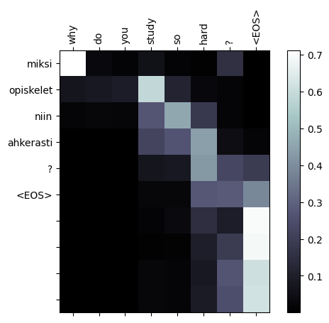

# Neural Machine Translation using Bahdanau (Additive) Attention

A simple implementation of the translation mechanism proposed in [Neural Machine Translation by Jointly Learning to Align and Translate](https://arxiv.org/abs/1409.0473) by Bahdanau, et al.

## Additive Attention

This project implements Bahdanau attention, a mechanism that enhances neural machine translation by allowing the model to focus on different parts of the input sequence for each prediction.

### Implementation

(1) The energy vector $e_i$ is calculated as:

$$
e_i = V\tanh(W_qQ_{i-1} + W_kK)
$$

where $V$, $W_q$, and $W_k$ are learnable weights, $Q_{i-1}$ is the decoder's previous hidden state (query vector), $K$ is the encoder's output (key matrix), and $\tanh$ is used to introduce non-linearity.

(2) The attention vector $\alpha$ is generated using the softmax function:

$$
\alpha_i = softmax(e)
$$

The softmax operation transforms the energy vector into a valid probability distribution, representing the attention weights.

(3) The context vector $c_i$ is calculated as:

$$
c_i = \sum_{j=1}^{T_x}\alpha_i K_j
$$

The context vector $c_i$ is the weighted sum of the encoder outputs.

This is the mechanism enables the model to dynamically weigh the importance of different parts of the input sequence based on the current decoding context.

## Examples

The project offers a quick and easy way to train your very own models with `.tsv` data:

```Python
from bahdanaunmt.utils import train

encoder, decoder = train('eng', 'fin', './data/eng-fin.tsv', n_epochs=50, learning_rate=1e-3)
```

This will automatically train your model. After it's done training it will also do some random evaluations and save an image of an attention map.

Example of attention map when translating sentence "Why do you study so hard?" into Finnish.



## Citations

"Neural Machine Translation by Jointly Learning to Align and Translate" by Bahdanau, et al.

```text
@article{bahdanau2014neural,
  title={Neural machine translation by jointly learning to align and translate},
  author={Bahdanau, Dzmitry and Cho, Kyunghyun and Bengio, Yoshua},
  journal={arXiv preprint arXiv:1409.0473},
  year={2014}
}
```
